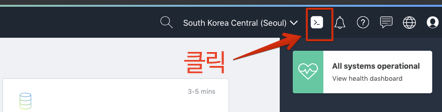

# Terraform
SKBB 환영 이미지  

핸즈온 환경 설명
 - Cloud Shell로 할 꺼다.
 
 혹시 개인 노트북으로 실행하고 싶은 사람은 링크를 눌러 참조하라


<details>
<summary>
<font size=4>1. 실습 환경 확인</font>
</summary>

## Cloud Shell 사용



>OCI Shell은 Web기반의 터미널에 접속할 있는 Oracle Cloud Console 기능입니다.  
리눅스 기반이며, OCI CLI를 이용할 수 있도록 인증관련 설정이 되어 있으며, OCI를 이용하면 필요로 하는 다양한 Tool들이 최신버전으로 설치되어 있습니다. 

 - 최신 버전의 OCI CLI(Orcommand Line Interface)와 다수의 유용한 도구로 사전 구성된 Linux 셸의 호스트로 사용할 임시 시스템
 - 홈 디렉토리를 위한 5GB의 스토리지
 - 콘솔에서 다른 페이지로 이동하더라도 Cloud Shell이 있는 하단의 프레임 변경없이 활성 상태를 유지


### 사전 설치된 유용한 도구들
 - Git
 - Java
 - Python (2 and 3)
 - SQL Plus
 - kubectl
 - helm
 - maven
 - gradle
 - terraform


자세한 사항은 [여기](https://docs.cloud.oracle.com/en-us/iaas/Content/API/Concepts/cloudshellintro.htm)를 참조하세요


### OCI CLI 설치 
개인 노트북에 직접 설치해서 실습을 원하는 분은 아래 링크를 참조하십시오
 - [OCL CLI 설정 기본 정보 수집](http://taewan.kim/tutorial_manual/handson_adw/05.preprocessing/3/)
 - [OCI CLI 설치 및 기본 설정](http://taewan.kim/tutorial_manual/handson_adw/05.preprocessing/4/)

### Terraform 설치
Terraform 설치는 아래 URL을 참고합니다.
https://learn.hashicorp.com/terraform/getting-started/install.html


#### OCI 설치 확인
```shell
# Basic Step
# oci cli version 확인
$ oci -v

# oci object storage namespace 확인
$ oci os ns get

# Advanced Step
# oci 설정 정보 확인
$ cat /etc/oci/config

# oci profile 확인
$ env | grep PROFILE
```

#### Terraform 설치 확인
```shell
# Terraform 설치확인
$ terraform version

```

</details>


### Terraform 실습 시나리오
Terraform 실습에서는 Compartment 1개, Virtual Cloud Network(가상 클라우드 네트워크), Security List(보안 목록), Route Table (라우트 테이블), Internet Gateway (인터넷 게이트웨이)와 2개의 Compute Instance (Oracle Linux7)을 프로비저닝합니다.

#TODO : 적용할 이미지 작성


### 실습 자료 Clone
실습용 코드가 있는 git repository를 clone한다.
```shell
$ git clone https://github.com/DannyKang/Terraform-HandsOn.git
```

#TODO tenancy ocid, user ocid
#tenancy_ocid = "ocid1.tenancy.oc1..aaaaaaaaez4bhe5yolhq6ejskarrclgjutpvygfmtfoygk7eb2hak3426zfa"
#user_ocid = "ocid1.user.oc1..aaaaaaaa3xuu55fs4ma4rreu37z4xfskhgx6simgrzsyrtmli5fm35aabgna"
#fingerprint = "b0:95:77:c5:cb:26:6d:d7:dd:33:9a:2f:1e:3f:36:49"
#private_key_path ="/Users/kih/.oci/ges_oke.pem"
#region = "ap-seoul-1"

### 실습 : 1. First Provision 
위 그림과 같은 환경을 적용해 본다.  
```shell
$ cd  Terraform-HandsOn/chapter1

# Terraform init, plan, apply
$ terraform init
$ terraform plan
$ terraform apply
```

#TODO : 각 단계 별 사진 추가
#TODO : 프로비전된 화면 확인 

생성했던 인프라 삭제
```shell
$ cd  Terraform-HandsOn/chapter1

# Terraform destroy
$ terraform destroy
```


### 모듈화된 실습 Terraform 소스 구조
OCI용 테라폼 프로젝트의 디렉토리 구조는 다음과 같습니다.
> 실습에서 사용되는 모듈은 compartment, vcn, compute입니다.

  ```shell
  $ cd Terraform-HandsOn/chapter2
  ```

제공되는 샘플은 루트 경로에 provider.tf, main.tf, vars.tf가 존재하고 하위 폴더에 모듈을 구성해서 각 모듈을 실행하는 형태로 구성되어 있습니다.


위 이미지의 내용은 다음과 같습니다.
1. OCI provider를 정의
2. terraform에서 사용할 변수 값을 정의하고 루트의 vars.tf에 값을 매핑
3. 실행할 모듈을 정의 (모듈로 변수값 전달)
4. 모듈별로 resource 정의

> Terraform의 변수는 기본적으로 환경변수 혹은 tfvars 파일에 정의한 값이 할당되는데, 할당된 변수값은 동일한 폴더 위치의 Block (resource, data등)에서 참조합니다. 따라서 상위 폴더의 변수의 값을 하위 모듈로 전달해야 하며, 하위 모듈의 경우도 동일하게 전달받을 변수를 가지고 있어야 합니다.


변수가 사용되는 방식은 다음과 같습니다.
1. env.tfvars에 정의된 값을 루트의 vars.tf에 할당
2. 루트의 vars.tf를 main.tf, provider.tf에서 사용
3. 루트의 main.tf에서 하위 모듈(compute, compartment, vcn)이 가지고 있는 vars.tf에 값을 전달
4. 각 모듈에서 동일한 위치에 존재하는 vars.tf 참조

### Terraform Init
이 작업은 provider에서 제공하는 terraform plugin을 OS환경에 맞게 다운로드 혹은 업데이트하며, 실행할 모듈의 정보에 대한 내용을 json파일로 생성합니다.

1. provider.tf가 있는 위치에서 다음과 같이 init을 실행합니다.
    ```shell
    $ cd meetup-200118-iac/terraform

    $ terraform init
    ```

2. OCI Plugin과 Module을 확인합니다.
    ```shell
    $ tree .terraform

    .terraform/
    ├── modules
    │   └── modules.json
    └── plugins
        └── linux_amd64
            ├── lock.json
            └── terraform-provider-random_v2.2.1_x4
    ```

### Terraform Plan
Terraform Plan을 실행하면 작성한 계획에 따라 정확히 수행되는지 미리 체크해볼 수 있습니다. HCL에 대한 검증도 함께 수행합니다. Plan 단계에서는 실제 인프라에 반영되지 않습니다.

* 동일한 경로에서 다음과 같이 수행합니다. **{os_user}** 부분을 자신의 os userid(e.g. user1)로 지정합니다.
    ```shell
    $ terraform plan -var-file="/home/{os_user}/.terraform/env/env.tfvars"

    Plan: 14 to add, 0 to change, 0 to destroy.
    ```

### Terraform Apply
실제로 인프라에 Terraform으로 구성한 계획을 실행합니다.

1. 동일한 경로에서 다음과 같이 수행합니다. 마찬가지로 **{os_user}** 부분을 자신의 os userid(e.g. user1)로 지정합니다.

    ```shell
    $ terraform apply -var-file="/home/{os_user}/.terraform/env/env.tfvars"
    ```

2. 실행하면 다음과 같이 Apply 실행에 대한 최종 Approve 여부를 물어봅니다. yes를 입력하고 엔터를 입력합니다.

    > apply와 destroy의 경우는 기본적으로 Approve 여부를 물어보는데, 실행시에 다음과 같이 auto-approve 옵션을 주면 Approve 단계를 건너뜁니다.  
    > terraform apply --auto-approve

    ```shell
    Do you want to perform these actions?
      Terraform will perform the actions described above.
      Only 'yes' will be accepted to approve.

      Enter a value: yes
    ```

3. 생성이 완료되면 다음과 같은 메시지를 볼 수 있습니다.
    ```shell
    Apply complete! Resources: 14 added, 0 changed, 0 destroyed.
    ```

### OCI Console에서 생성된 Resource 확인
1. 다음 주소로 OCI Console에 접속합니다.
    > https://console.ap-seoul-1.oraclecloud.com

2. 실습을 위해 각자 제공된 Cloud Tenant(e.g. meetup101)를 입력한 후 **Continue** 를 클릭합니다.
    

3. 실습을 위해 각자 제공된 OCI 계정(ID/PW)을 입력한 후 **Sign In** 을 클릭합니다.
    

4. Compute Instance 확인을 위해 다음 페이지로 이동합니다.
    > 좌측 상단 햄버거 메뉴 > Compute > Instances
    

5. 생성된 Compartment와 Instance를 확인합니다.
    

6. 마찬가지로 생성된 VCN 확인을 위해 다음 페이지로 이동합니다.
    > 좌측 상단 햄버거 메뉴 > Networking (네트워킹) > Virtual Cloud Networks (가상 클라우드 네트워크)

7. 생성된 VCN을 확인합니다.
    


2. 

1. 환경 설정 
